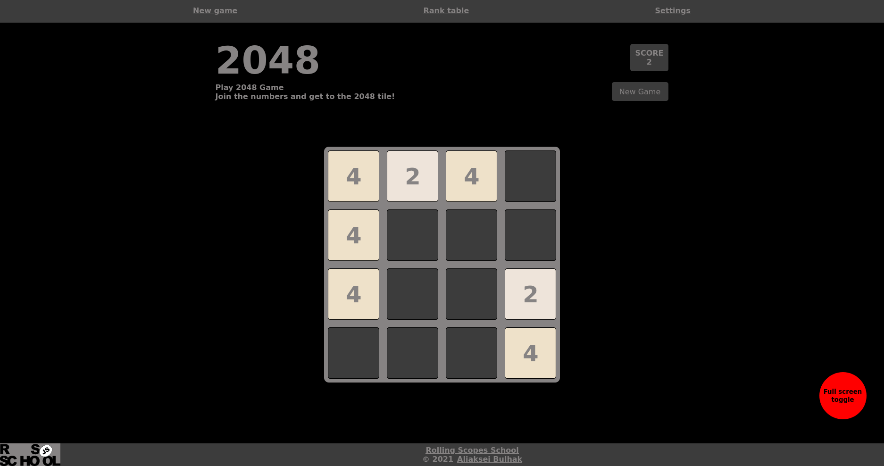

## Task: https://github.com/rolling-scopes-school/tasks/blob/master/tasks/react/react-game.md

Screenshot:
   

To start application you need to have `npm` installed on your computer

Steps to start
- `npm run ci` - this command will install all dependecies with versions specified in package-lock.json
- `npm run start` - will start application with webpack dev server
- then you can open application in your preffered browser under `http://localhost:3000`